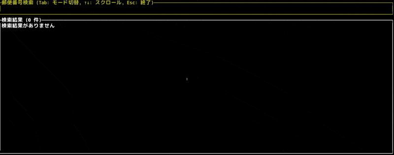

# jposta 📮

A fast and intuitive Terminal User Interface (TUI) tool for searching Japanese postal codes and addresses. 🗾



## ✨ Features

- 🔍 Real-time postal code lookup with partial matching
- 🈯 Address search with Japanese text (kanji/kana)
- ⌨️ Interactive TUI with keyboard navigation
- 📜 Scrollable results with formatting
- 🔄 Dual search modes

## 🚀 Installation

```bash
cargo install jposta
```

## 🎮 Usage

Start the application:
```bash
jposta
```

### ⌨️ Keyboard Controls

- `Tab`: Toggle between postal code and address search modes
- `↑/↓`: Scroll through results
- `Backspace`: Delete input
- `Esc`: Exit

### 🔍 Search Modes

1. **Postal Code Search** 📫
   - Enter numbers (e.g., "100" for all codes starting with 100)
   - Results show full addresses with kana readings

2. **Address Search** 🏢
   - Enter text in Japanese (e.g., "渋谷" or "シブヤ")
   - Matches any part of the address

## 📝 Example Output

```
〒1000001
東京都千代田区千代田
トウキョウトチヨダクチヨダ
```

## 🛠️ Building from Source

```bash
git clone https://github.com/nwiizo/jposta
cd jposta
cargo build --release
```

## 📦 Dependencies

- 🖥️ ratatui
- ⚡ crossterm
- 📨 jpostcode_rs

## 📜 License

MIT License

## 🤝 Contributing

1. Fork the repository
2. Create your feature branch
3. Commit your changes
4. Push to the branch
5. Create a Pull Request

## 🙏 Acknowledgments

- Based on the [jpostcode_rs](https://github.com/nwiizo/jpostcode_rs) library
- Japanese postal code data provided by Japan Post

## 👤 Author

nwiizo
